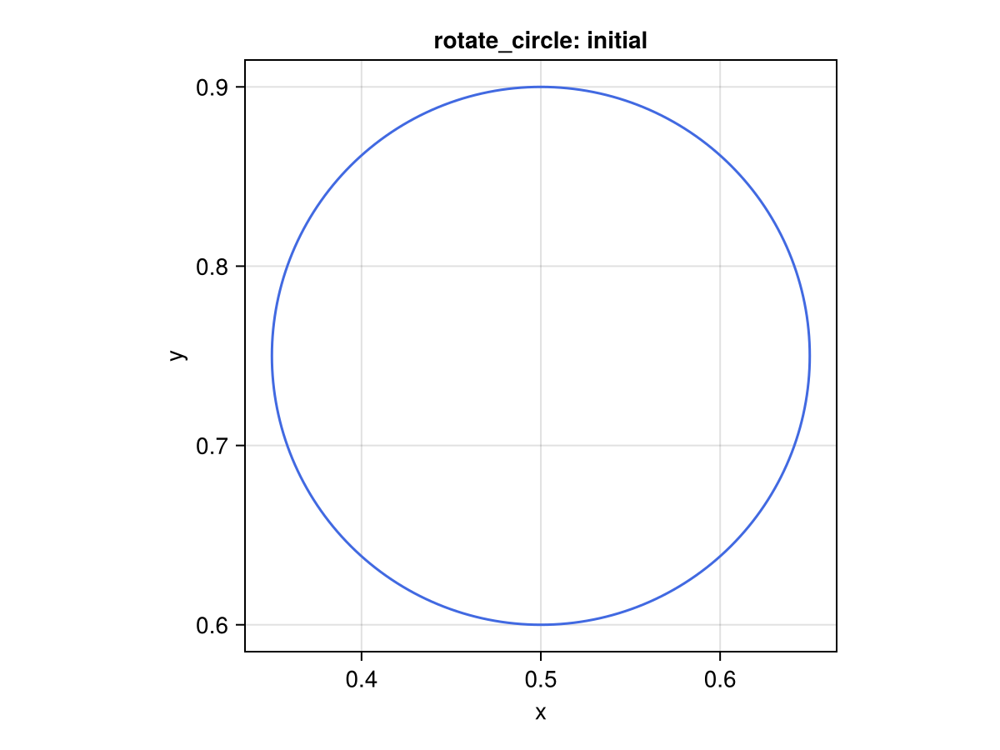
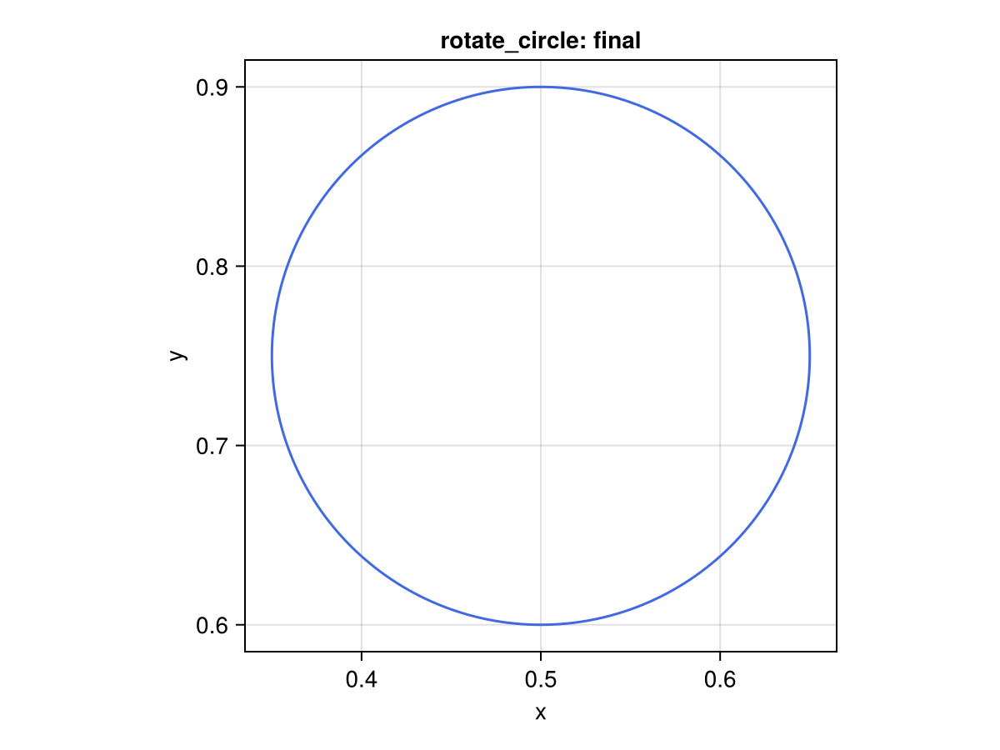
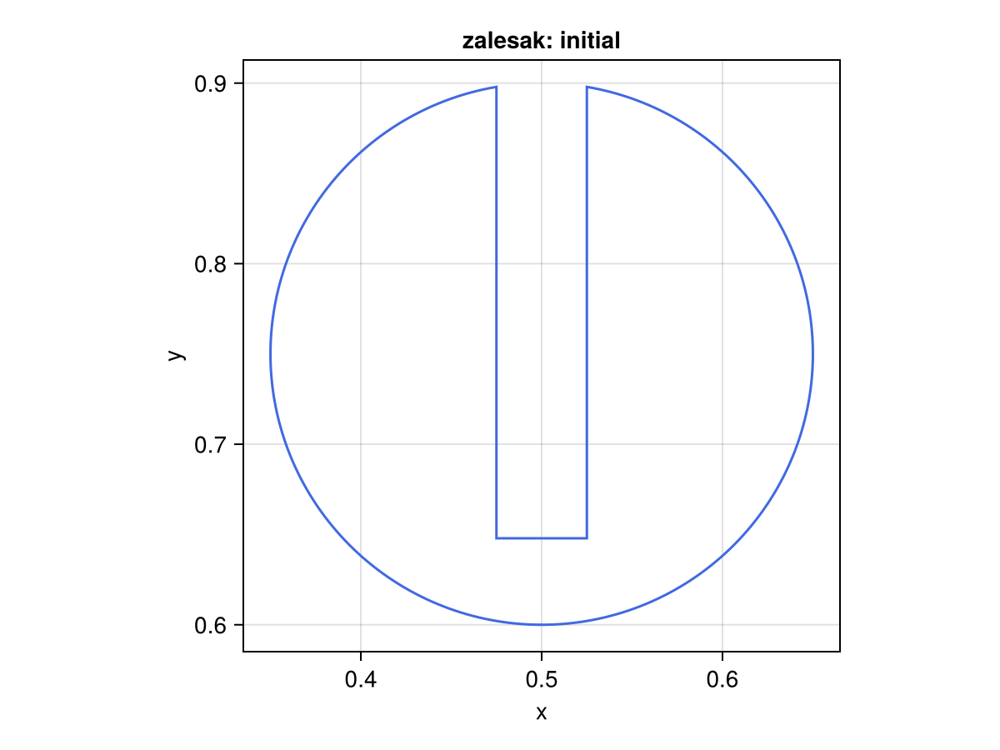
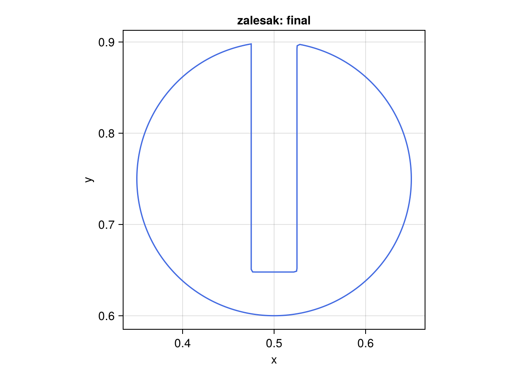
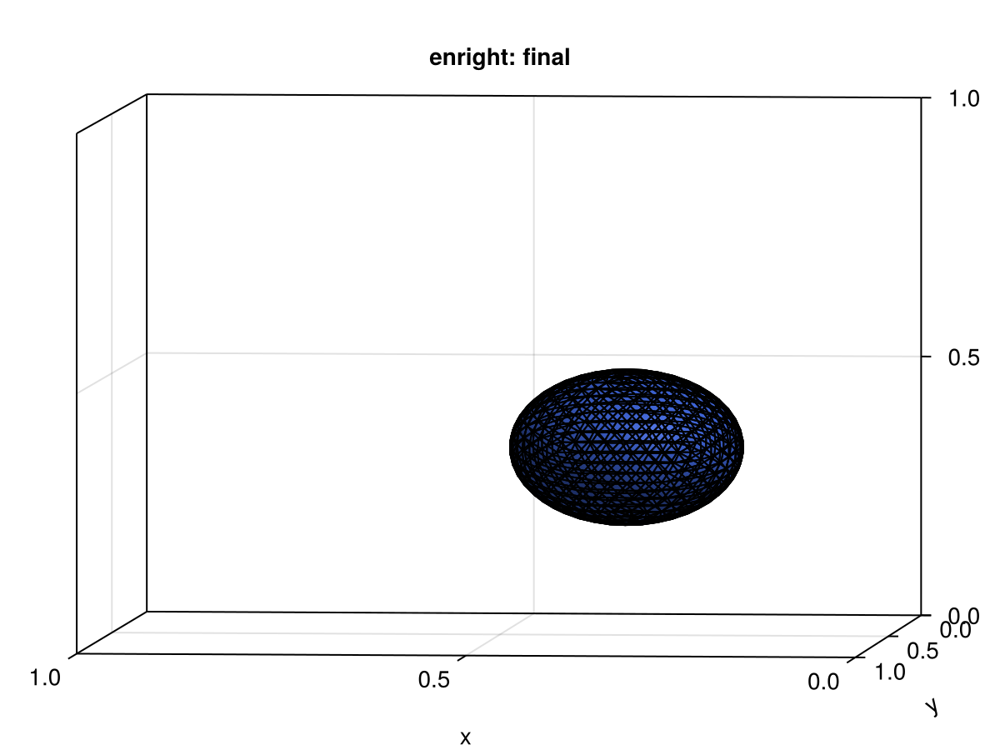
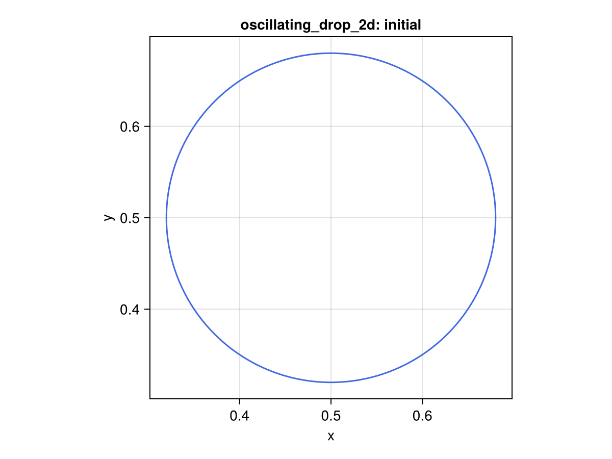
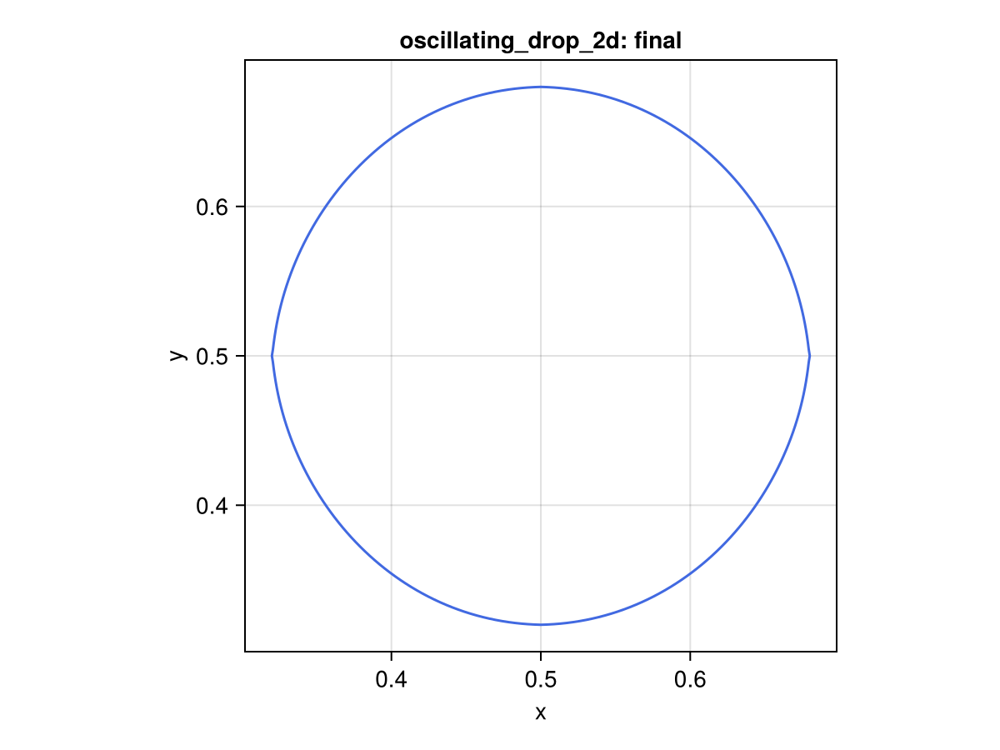
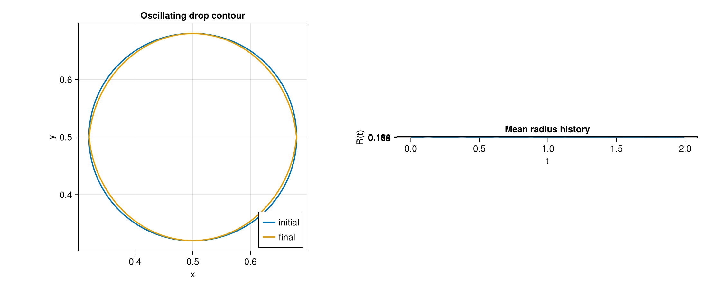

# Examples

Short descriptions of example scripts included in the repository (`examples/`).

- `curve_shortening_circle.jl` — curve-shortening (mean-curvature) flow on a circle.
- `deformation16_2d.jl` — 2-D 16-vortex deformation benchmark setup.
- `enright_deformation_3d.jl` — Enright 3-D deformation smoke test on a coarse sphere.
- `expand_circle_normal_speed.jl` — outward normal motion example.
- `oscillating_drop_2d.jl` — periodic 2-D drop oscillation with animation and diagnostic plot.
- `redistribute_curve_demo.jl` — demonstrates curve redistribution strategies.
- `rider_kothe_single_vortex.jl` — Rider–Kothe reversible vortex benchmark.
- `rotate_circle.jl` — circle rigid rotation demo.
- `rotate_sphere.jl` — rigid rotation demo for a sphere.
- `serpentine_2d.jl` — serpentine deformation benchmark setup.
- `translate_circle.jl` — translation demo for a circle.
- `translate_sphere.jl` — translation demo for a sphere.
- `zalesak_disk_rotation.jl` — Zalesak disk rotation demo.
- `zalesak_sphere_rotation.jl` — coarse 3-D slotted-sphere rigid-rotation benchmark.

To run an example interactively:

```bash
julia --project=. examples/rotate_circle.jl
```

Examples that evolve fronts now use `CairoMakie` and write outputs under:

- `examples/output/<example_name>/initial.png`
- `examples/output/<example_name>/final.png`
- `examples/output/<example_name>/animation.mp4`

Examples are intentionally small; for longer convergence or benchmarking
scripts see the `test/` harness and the `benchmark_*.jl` helpers in `src/`.

## Visual gallery from examples/output

The docs build mirrors `examples/output/` into `docs/src/assets/generated/examples_output/`.
The images below are read directly from those generated assets.

### rotate_circle




Video: [rotate_circle animation.mp4](assets/generated/examples_output/rotate_circle/animation.mp4)

### zalesak_disk_rotation




Video: [zalesak_disk_rotation animation.mp4](assets/generated/examples_output/zalesak_disk_rotation/animation.mp4)

### enright_deformation_3d




Video: [enright_deformation_3d animation.mp4](assets/generated/examples_output/enright_deformation_3d/animation.mp4)

### oscillating_drop_2d





Video: [oscillating_drop_2d animation.mp4](assets/generated/examples_output/oscillating_drop_2d/animation.mp4)
